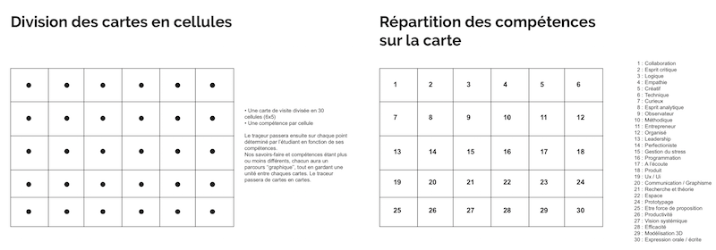
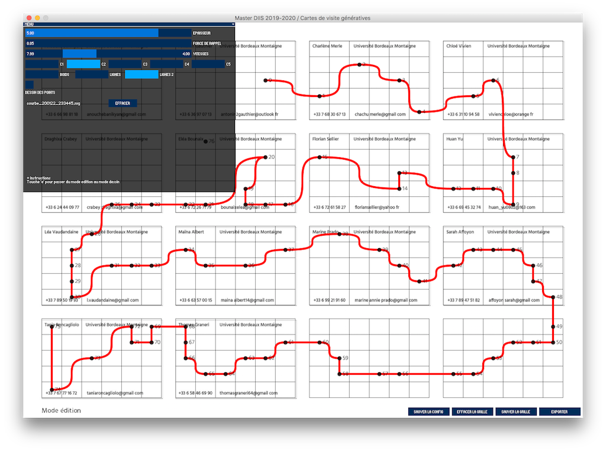
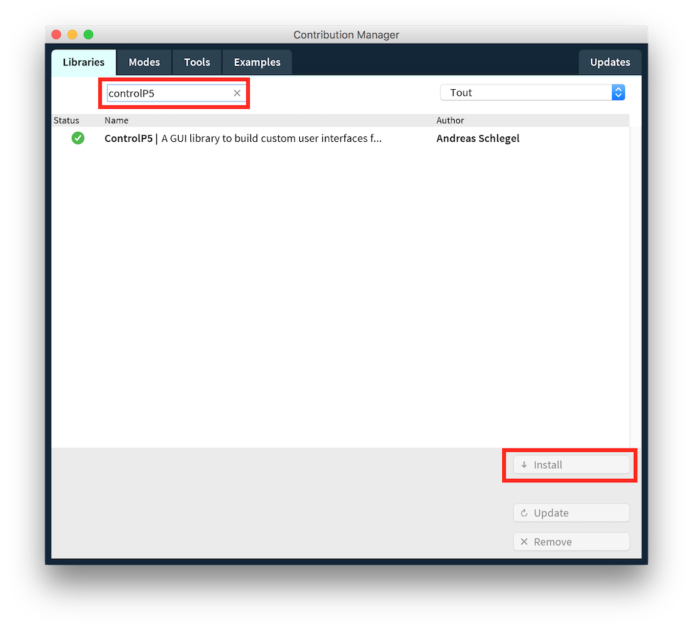
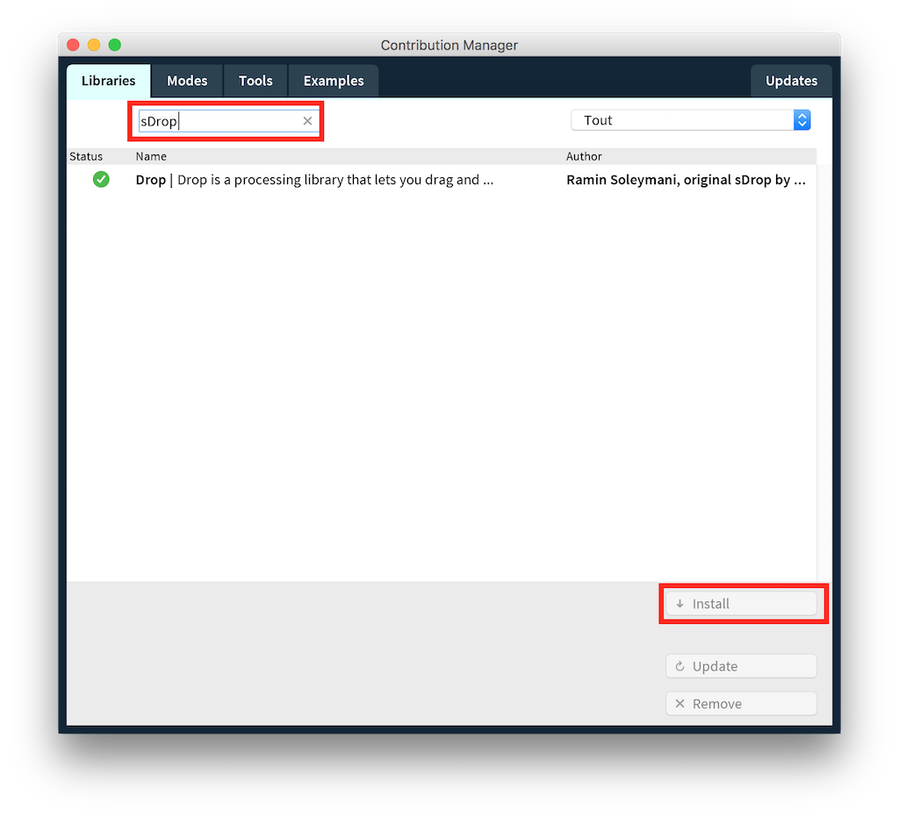
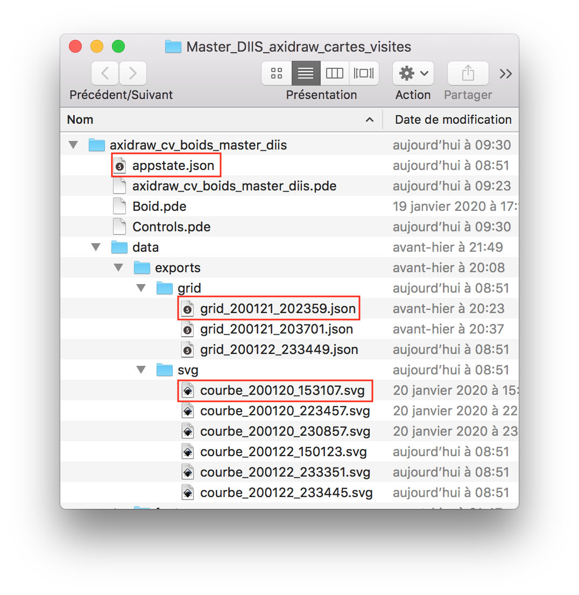
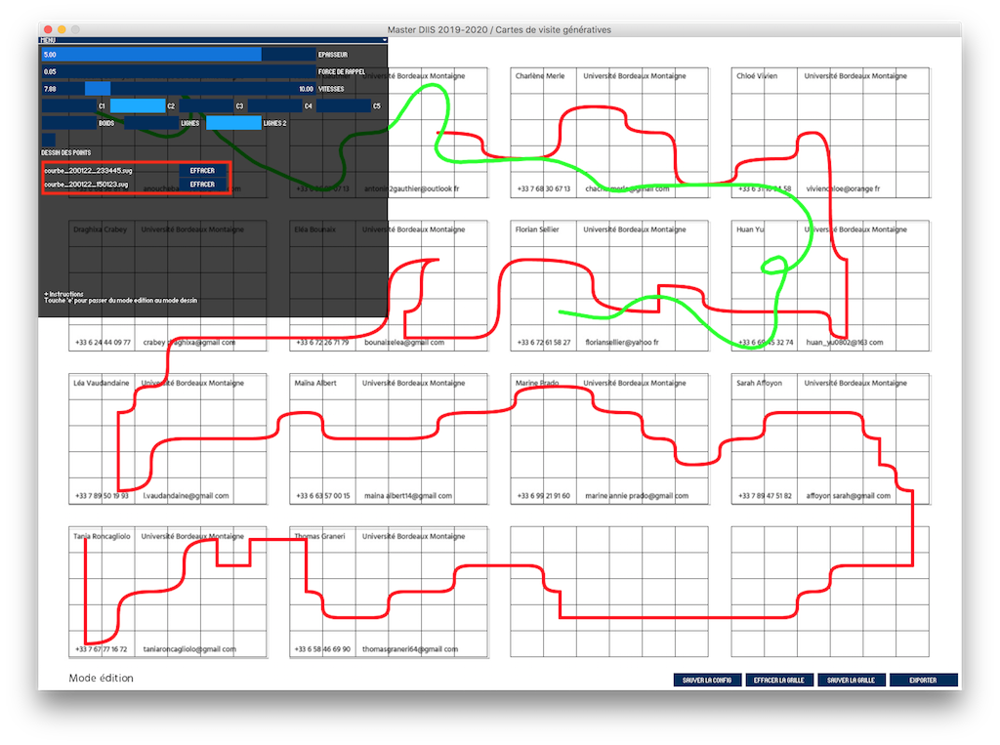
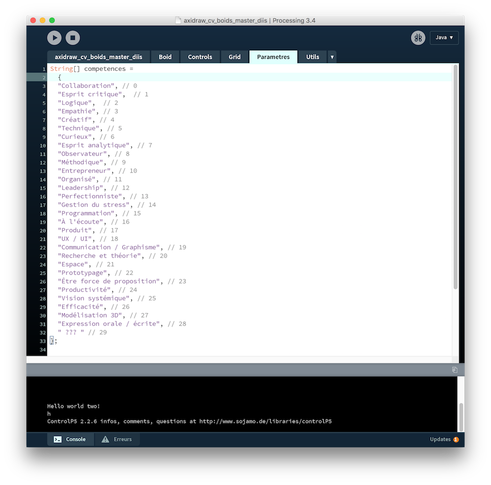

# Cartes de visites Master DIIS promo 2021
Outil pour générer les motifs pour des cartes de visite.

### Scénario
Chaque étudiant possède et développe au sein du master des compétences propres et complémentaires des autres étudiants, exprimées lors de projets en groupe notamment. Cette création de cartes de visite génératives vise à représenter ces spécificités et complémentarités en reliant par un trait continu chaque carte, comportant chacune les compétences de l'étudiant symbolisées par une cellule.

### Préambule
L'outil a été écrit avec Processing qui est dans sa conception est antérieur à p5.js dont nous avons étudié les bases en cours au mois d'octobre et de novembre. Ayant déjà des algorithmes « prêt à l'emploi » pour l'export au format vectoriel, j'ai préféré développer avec pour des raisons d'efficacité.

Si la syntaxe est différente (notamment pour la déclaration *typée) de variables)*, la logique d'application reste néanmoins la même avec l'articulation autour des gestionnaires **setup()** et **draw()**, et des gestionnaires d'évènements qui captent en particulier les déplacements et les clicks souris / clavier. 

### Installation
* Télécharger [Processing 3.5.4](https://processing.org/download/)
* Utiliser le bouton *clone or download* (en vert, en haut à droite sur cette page) pour télécharger le sketch. 
* En cliquant sur un des fichiers .pde, Processing devrait s'ouvrir avec le code qui est scindée en plusieurs onglets.
* Il est nécessaire d'installer deux librairies ([ControlP5](http://www.sojamo.de/libraries/controlP5/) pour la gestion d'interface graphique et une version modifiée de [Drop](http://www.sojamo.de/libraries/drop/) qui permet la gestion de glisser-déposer de fichiers dans l'application). Pour ce faire, il faut ouvrir le gestionnaire de librairies de Processing depuis le menu **Sketch > Importer une librairie ... > Ajouter une librairie ...**
* Dans **l'onglet Librairies**, vous pouvez taper ControlP5 et SDrop pour trouver les libraries et cliquer sur le bouton Install pour les installer. 

### Outil
L'outil dispose de deux modes, on passe de l'un à l'autre **en appuyant sur la touche 'e' du clavier**
* **un mode d'édition** qui permet de modifier les points / compétences de chaque carte.
* **un mode simulation / courbe** qui permet de visualiser différents types de courbes reliant les points. Il y a trois types de courbes : 
  * **mode boids** qui « lance » [un agent autonome](https://fr.wikipedia.org/wiki/Boids) qui va aller de point en point avec une certaine vitesse / accélération , produisant un rendu avec des boucles.
  * **mode lignes**, chaque point est relié au suivant avec un segment simple.
  * **mode lignes 2**, chaque point est relié au suivant avec un segment simple ou une courbe de [Bézier](https://processing.org/reference/bezier_.html).

#### Menu
* **Epaisseur** : en mode courbe, paramètre l'épaisseur des lignes.
* **Force de rappel** : en mode courbe / rendu boids, paramètre la force avec laquelle l'agent autonome va être attiré vers le point. 
* **Vitesses** : en mode courbe / rendu boids, paramètre les vitesses minimales et maximales de l'agent autonome. Par exemple, si les vitesses sont faibles et la force de rappel grande, l'agent aura tendance à se déplacer en ligne droite.
* **C1 | C2 | C3 | C4 | C5** : en mode courbe, choix de la couleur.
* **Boids | Lignes | Lignes 2** : en mode courbe, choix du mode de rendu.
* **Dessin des points** : en mode courbe, active ou non le rendu des cibles pour un dessin très Bordeaux Métropole ;-)

### Menu boutons
* **Relancer** : en rendu boids, permet de relancer l'agent autonome.
* **Sauvegarder la config** : si des courbes et une grille de points ont été importés par glisser-déposer (voir le paragraphe Export / Sauvegarde), la configuration est sauvée dans le fichier appState.json et cette configuration est rechargée au prochain démarage de l'application.
* **Effacer la grille** : efface tous les points de la grille.
* **Sauver la grille** : sauvegarde la configuration de la grille dans un fichier horodaté dans le dossier **data/exports/grid** (voir capture)
* **Exporter** : exporte la courbe en format vectoriel dans un fichier horodaté dans le dossier **data/exports/svg**. C'est ce type de fichiers dont nous allons nous servir pour l'impression avec le traceur axidraw. Ces courbes sont éditables avec des applications type Illustrator par exemple.

### Importer des courbes
Il est possible d'importer par glisser-déposer dans l'application des courbes qui ont été préalablement sauvegardées dans le dossier **data/exports/svg** Ces courbes ne sont plus modifiables directement depuis l'application, elle peuvent être effacée depuis l'interface avec le bouton « effacer » (voir capture)

### Importer des points
De même, il est possible d'importer par glisser-déposer dans l'application une configuration de points sauvegardée dans le dossier **data/exports/grid**

NB : le glisser-déposer ne marche que pour un seul fichier à la fois, pas possible de glisser-déposer plusieurs fichiers en même temps.

### Éditer le code
Il est aussi possible d'éditer les compétences ainsi que leur ordre directement dans le code, dans l'onglet **Paramètres**. Il faut absolumment en laisser 30 (indexée de 0 à 29). De même, il est possible d'éditer les cinq couleurs dans le tableau *colorBoids*.

